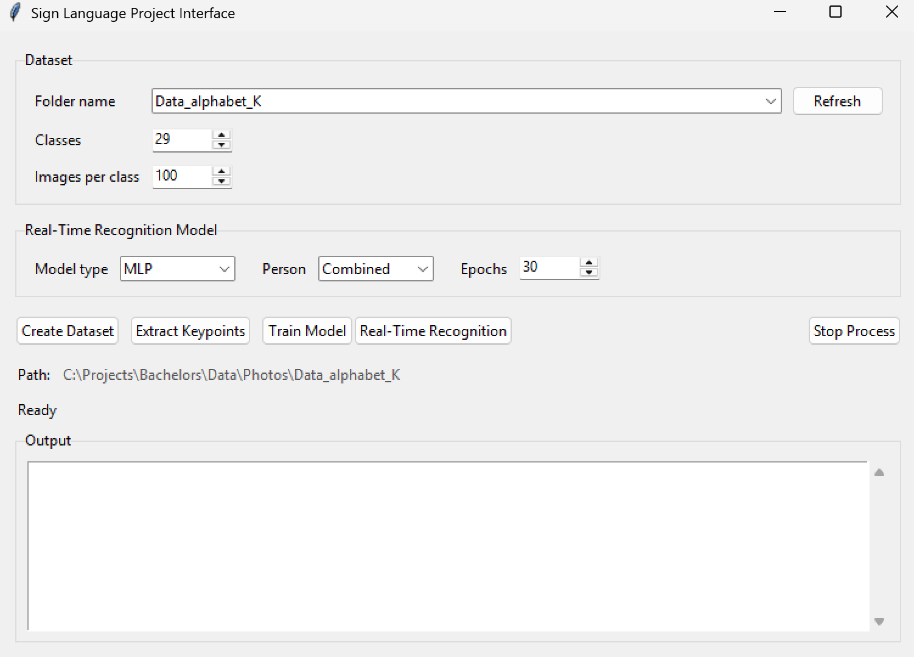
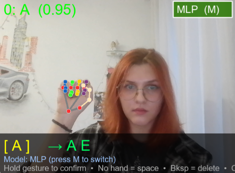

# Інтелектуальна система розпізнавання та перекладу жестів українського жестового алфавіту 

> Робота проводить дослідження впливу типу та якості даних, а також моделей для завдання розпізнавання жестів українського жестового алфавіту. Для цього був створений настільний Python-застосунок для створення датасету жестів, навчання моделей MLP/CNN та розпізнавання жестової абетки в реальному часі через вебкамеру.

---

## Автор

- **ПІБ**: Чухрай Катерина Олександрівна
- **Група**: ФЕІ-42с
- **Керівник**: доц. Демків Л.С.
- **Дата виконання**: 24.05.2026

---

## Загальна інформація

- **Тип проєкту**: настільний застосунок з графічним інтерфейсом
- **Мова програмування**: Python 3.10
- **Основні бібліотеки**: OpenCV, MediaPipe, TensorFlow/Keras, NumPy, Pillow, scikit-learn, h5py, Tkinter
- **Основний файл запуску**: `joint_interface.py`
- **Джерело відео**: вебкамера
- **Типи моделей**:
  - `MLP` - класифікація за ключовими точками руки
  - `CNN` - класифікація за зображенням жесту

---

## Опис функціоналу

- Створення власного фото-датасету з вебкамери.
- Збереження фото у структурі `Data/Photos/<назва_датасету>/<клас>/`.
- Витяг ключових точок руки через MediaPipe.
- Збереження keypoints-файлів у папку `Data/`.
- Навчання власної MLP моделі на ключових точках.
- Навчання власної CNN моделі на зображеннях.
- Запуск стандартних моделей `K`, `O`, `R`, `Combined`.
- Запуск власної моделі через варіант `Custom`.
- Розпізнавання жестів у реальному часі.
- Формування рядка з розпізнаних символів.
- Очищення або редагування результату під час розпізнавання.

---

## Опис основних файлів

| Файл / папка | Призначення |
|---|---|
| `joint_interface.py` | Головний графічний інтерфейс проєкту |
| `get_photos.py` | Збір фото з вебкамери для нового датасету |
| `extract_keypoints.py` | Витяг ключових точок руки з фото-датасету |
| `train_models.py` | Навчання власних MLP та CNN моделей |
| `real_time_recogntion.py` | Розпізнавання жестів у реальному часі |
| `Data/Photos/` | Папка з фото-датасетами |
| `Data/` | Папка з `.pickle` файлами ключових точок |
| `models/` | Папка зі збереженими моделями та label map файлами |
| `README.md` | Інструкція користувача |

---

## Файли дослідження

| Файл | Призначення |
|---|---|
| data_analisis.ipynb | Блокнот дослідження вхідних даних моделі |
| models.ipynb | Блокнот тренування моделей та валідації на різних датасетах |

---

## Структура даних

Фото зберігаються окремо від keypoints-файлів:

```text
Bachelors/
  Data/
    Photos/
      Test/
        0/
          0.jpg
          1.jpg
        1/
          0.jpg
          1.jpg
    Test_keypoints.pickle
  models/
    custom_Test_mlp.h5
    custom_Test_mlp_label_map.pkl
    custom_Test_cnn.h5
    custom_Test_cnn_label_map.pkl
```

---

## Як запустити проєкт з нуля

### 1. Встановлення інструментів

Потрібно мати Python 3.10 та встановлені залежності:

```text
opencv-python
mediapipe
numpy
pillow
tensorflow
scikit-learn
h5py
```

Якщо використовується віртуальне середовище, активуйте його перед запуском.

### 2. Перехід у папку проєкту

```powershell
cd C:\Projects\Bachelors
```

### 3. Запуск графічного інтерфейсу

```powershell
python joint_interface.py
```

Або, якщо використовується конкретне середовище:

```powershell
C:\Projects\venv310\Scripts\python.exe joint_interface.py
```

---

## Інструкція користувача

### 1. Створення датасету

1. Запустіть `joint_interface.py`.
2. У полі **Folder name** введіть назву датасету, наприклад `Test`.
3. У полі **Classes** вкажіть кількість класів.
4. У полі **Images per class** вкажіть кількість фото для кожного класу.
5. Натисніть **Create Dataset**.
6. Для кожного класу натискайте `S`, коли будете готові почати запис фото.

Фото буде збережено у:

```text
Data/Photos/<назва_датасету>/
```

### 2. Витяг ключових точок

Цей крок потрібен для навчання MLP моделі.

1. Виберіть потрібний датасет у полі **Folder name**.
2. Натисніть **Extract Keypoints**.

Після завершення буде створено файл:

```text
Data/<назва_датасету>_keypoints.pickle
```

### 3. Навчання власної моделі

1. Виберіть датасет у полі **Folder name**.
2. У полі **Model type** виберіть `MLP` або `CNN`.
3. У полі **Epochs** задайте кількість епох навчання.
4. Натисніть **Train Model**.

Для `MLP` перед навчанням обов'язково потрібно виконати **Extract Keypoints**.

Навчені моделі зберігаються у папку `models/`:

```text
models/custom_<назва_датасету>_mlp.h5
models/custom_<назва_датасету>_mlp_label_map.pkl
models/custom_<назва_датасету>_cnn.h5
models/custom_<назва_датасету>_cnn_label_map.pkl
```

### 4. Запуск розпізнавання

Для стандартної моделі:

1. Виберіть **Model type**.
2. Для `MLP` виберіть одну з моделей: `K`, `O`, `R`, `Combined`.
3. Натисніть **Real-Time Recognition**.

Для власної моделі:

1. Виберіть датасет.
2. Виберіть тип моделі `MLP` або `CNN`.
3. У полі вибору моделі виберіть `Custom`.
4. Натисніть **Real-Time Recognition**.

У вікні розпізнавання модель лише відображається як індикатор. Перемикання моделі всередині вікна розпізнавання вимкнено.

Клавіші керування:

| Клавіша | Дія |
|---|---|
| `Backspace` | Видалити останній символ |
| `C` | Очистити поточний текст |
| `Esc` | Закрити вікно розпізнавання |

---

## Запуск через командний рядок

### Збір фото

```powershell
python get_photos.py --data-dir Data/Photos/Test --classes 29 --dataset-size 100
```

### Витяг ключових точок

```powershell
python extract_keypoints.py --data-dir Data/Photos/Test --output Data/Test_keypoints.pickle
```

### Навчання MLP

```powershell
python train_models.py --data-dir Data/Photos/Test --keypoints Data/Test_keypoints.pickle --model-type MLP --name Test --epochs 30
```

### Навчання CNN

```powershell
python train_models.py --data-dir Data/Photos/Test --model-type CNN --name Test --epochs 30
```

### Запуск стандартної моделі

```powershell
python real_time_recogntion.py
```

За замовчуванням запускається:

```text
MLP / Combined
```

### Запуск конкретної MLP моделі

```powershell
python real_time_recogntion.py --model-type MLP --person K
```

### Запуск власної MLP моделі

```powershell
python real_time_recogntion.py --model-type MLP --person Custom --model-name Test --mlp-model-path models/custom_Test_mlp.h5 --mlp-labels-path models/custom_Test_mlp_label_map.pkl
```

### Запуск власної CNN моделі

```powershell
python real_time_recogntion.py --model-type CNN --model-name Test --cnn-model-path models/custom_Test_cnn.h5 --cnn-labels-path models/custom_Test_cnn_label_map.pkl
```

---

## Приклади / скріншоти

### Головне вікно програми



### Розпізнавання у реальному часі



#### Приклад розпізнавання та формування текстової послідовності


---

## Проблеми і рішення

| Проблема | Рішення |
|---|---|
| Камера не відкривається | Перевірити підключення вебкамери, дозволи Windows і чи не зайнята камера іншою програмою |
| Для MLP немає keypoints-файлу | Натиснути **Extract Keypoints** перед навчанням MLP |
| Custom модель не запускається | Перевірити, що модель навчена для поточного датасету і файли є у папці `models/` |
| Помилка `batch_shape` або `DTypePolicy` | Запускати актуальний `real_time_recogntion.py`, у якому є сумісний завантажувач моделей |
| Помилка через різну довжину keypoints | Під час навчання приклади з нетиповою довжиною автоматично пропускаються |
| Несумісність TensorFlow або MediaPipe | Використати Python 3.10 та встановити залежності у відповідне віртуальне середовище |

---

## Примітки щодо навчання MLP

MLP модель очікує 42 ознаки:

```text
21 точка руки * 2 координати = 42
```

Якщо MediaPipe знаходить дві руки, можуть з'явитися приклади з 84 ознаками. Під час навчання такі приклади автоматично пропускаються, якщо більшість датасету має довжину 42.

Приклад повідомлення:

```text
Skipped 26 keypoint samples with non-42 feature length
```

---

## Використані джерела / література (без наукових статей)

- OpenCV documentation: https://docs.opencv.org/
- MediaPipe Hands documentation: https://developers.google.com/mediapipe/solutions/vision/hand_landmarker
- TensorFlow / Keras documentation: https://www.tensorflow.org/
- scikit-learn documentation: https://scikit-learn.org/
- Python documentation: https://docs.python.org/3/


---
